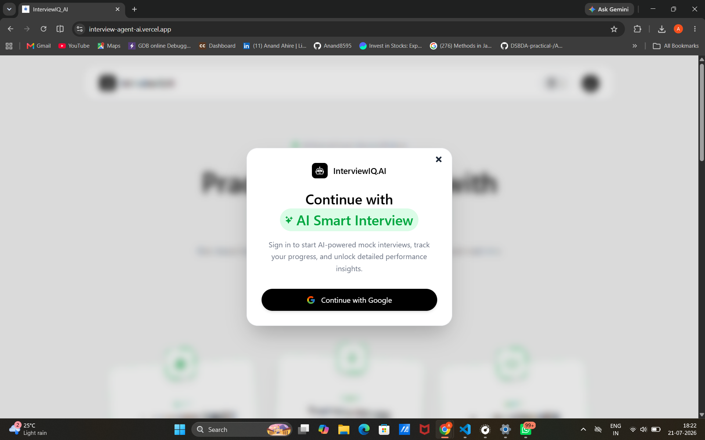
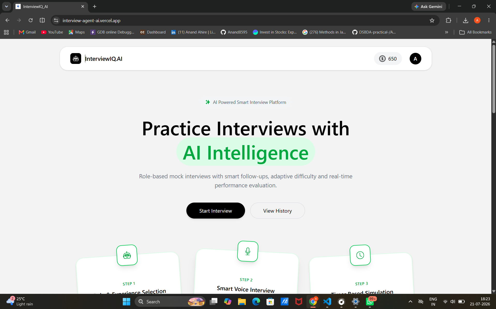
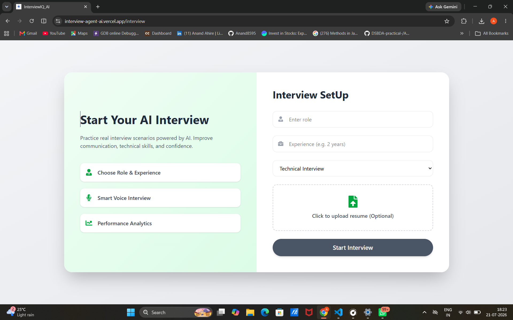
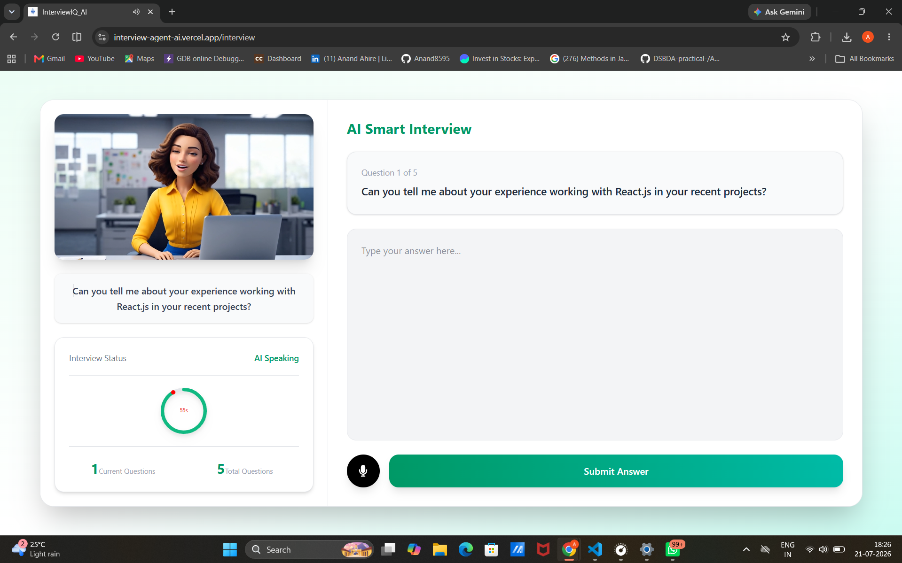
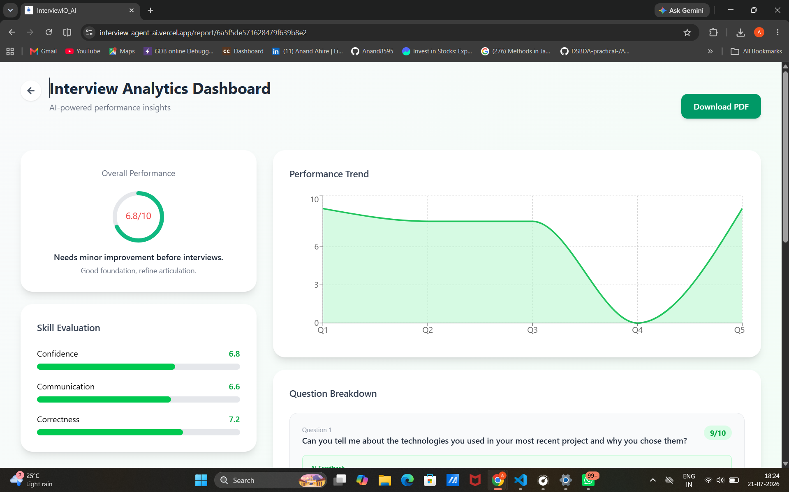
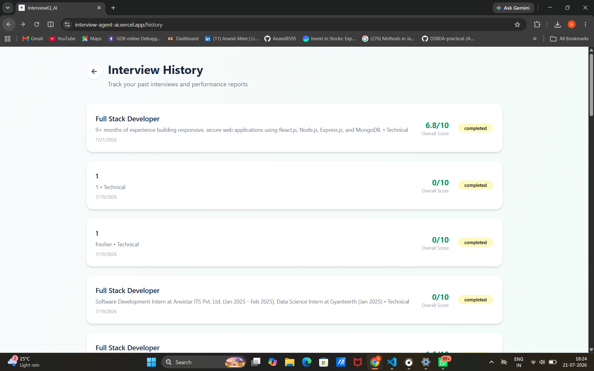
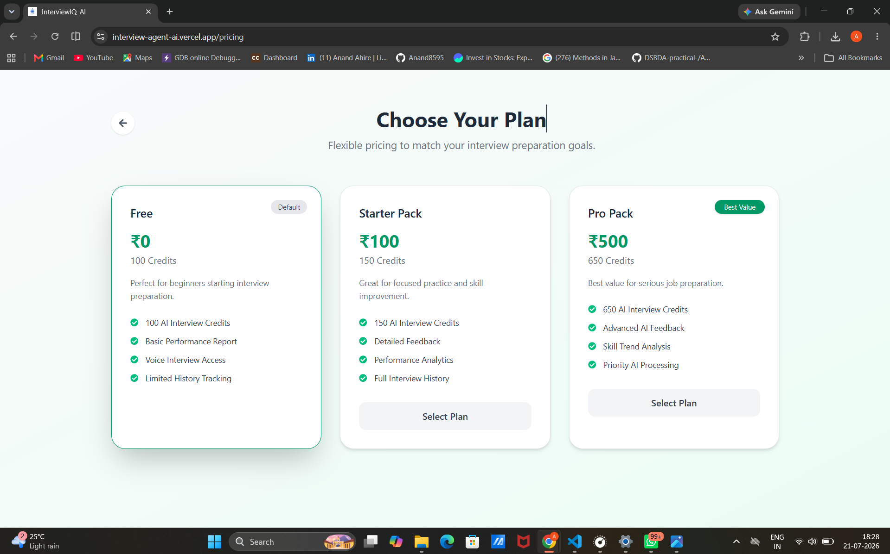

# 🤖 InterviewAgent AI

<p align="center">
  <strong>AI-Powered Smart Interview Platform built with MERN Stack, OpenRouter AI, Firebase Authentication, and Razorpay.</strong>
</p>

<p align="center">
  Practice real interview questions, receive AI-powered feedback, improve your communication skills, and track your interview progress.
</p>

---

## 🚀 Live Demo

🌐 **Frontend:** https://interview-agent-ai.vercel.app

⚙️ **Backend API:** https://interview-agent-ai-backend.onrender.com

---

## 📸 Screenshots

<table>
<tr>
<td align="center">
<b>🔐 Login Page</b><br>

</td>

<td align="center">
<b>🏠 Home Page</b><br>

</td>
</tr>

<tr>
<td align="center">
<b>⚙️ Interview Setup</b><br>

</td>

<td align="center">
<b>🎤 AI Interview</b><br>

</td>
</tr>

<tr>
<td align="center">
<b>📊 Interview Report</b><br>

</td>

<td align="center">
<b>📜 Interview History</b><br>

</td>
</tr>

<tr>
<td align="center" colspan="2">
<b>💳 Pricing & Payment</b><br>

</td>
</tr>
</table>

# ✨ Features

- 🔐 Google Authentication using Firebase
- 👤 Secure User Authentication with JWT
- 🤖 AI-generated role-based interview questions
- 🎤 Real-time voice interview interaction
- 🗣️ AI speech synthesis
- 📝 Submit interview answers
- 📊 AI-powered performance evaluation
- 📄 Download interview reports as PDF
- 💳 Razorpay payment integration
- 📜 Interview history management
- 📱 Fully responsive UI
- ⚡ Fast and modern React interface

---

# 🛠️ Tech Stack

| Category | Technologies |
|----------|--------------|
| Frontend | React.js, Vite, Tailwind CSS, Redux Toolkit, Axios |
| Backend | Node.js, Express.js |
| Database | MongoDB Atlas, Mongoose |
| Authentication | Firebase Authentication, JWT |
| AI Integration | OpenRouter API |
| Payments | Razorpay |
| Deployment | Vercel, Render |

---

# 📂 Project Structure

```text
InterviewAgent/
│
├── client/
│   ├── public/
│   ├── src/
│   │   ├── components/
│   │   ├── pages/
│   │   ├── redux/
│   │   ├── services/
│   │   ├── hooks/
│   │   └── App.jsx
│   │
│   └── package.json
│
├── server/
│   ├── config/
│   ├── controllers/
│   ├── middleware/
│   ├── models/
│   ├── routes/
│   ├── services/
│   ├── utils/
│   ├── index.js
│   └── package.json
│
├── screenshots/
│
└── README.md
```

---

# ⚙️ Installation

## Clone Repository

```bash
git clone https://github.com/Anand8595/interview-agent-ai.git
```

```bash
cd interview-agent-ai
```

## Install Frontend

```bash
cd client
npm install
npm run dev
```

## Install Backend

```bash
cd ../server
npm install
npm run dev
```

---

# 🔑 Environment Variables

Create a `.env` file inside the **server** folder.

```env
PORT=8000

MONGODB_URL=your_mongodb_connection_string

JWT_SECRET=your_jwt_secret

OPENROUTER_API_KEY=your_openrouter_api_key

RAZORPAY_KEY_ID=your_key_id

RAZORPAY_KEY_SECRET=your_key_secret

CLIENT_URL=http://localhost:5173
```

---

# 🚀 Future Improvements

- 🎥 Video Interview Support
- 💻 Coding Interview Mode
- 📄 Resume-based Interview Generation
- 🌍 Multi-language Support
- 📈 User Analytics Dashboard
- 🎯 Difficulty Level Selection
- 📊 Leaderboard
- 🤖 Multiple AI Interviewers

---

# 🎯 Learning Outcomes

This project helped me gain practical experience in:

- Building a full-stack MERN application
- REST API development
- JWT Authentication
- Firebase Authentication
- MongoDB Atlas integration
- AI integration using OpenRouter API
- Voice interaction using Web Speech API
- Razorpay payment integration
- PDF generation
- Redux Toolkit
- Deployment using Vercel and Render
- Git & GitHub workflow

---

# 👨‍💻 Author

## Anand Ahire

🔗 **GitHub**

https://github.com/Anand8595

🔗 **LinkedIn**

https://www.linkedin.com/in/anand-ahire-142519307/

---

# 🤝 Contributing

Contributions, issues, and feature requests are welcome.

Feel free to fork this repository and submit a pull request.

---

# ⭐ Show Your Support

If you found this project useful, please consider giving it a ⭐ on GitHub.

It helps others discover the project and motivates future improvements.

---

<p align="center">
Made with ❤️ by <strong>Anand Ahire</strong>
</p>
